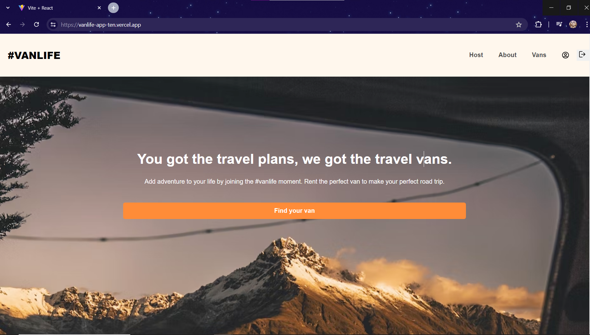
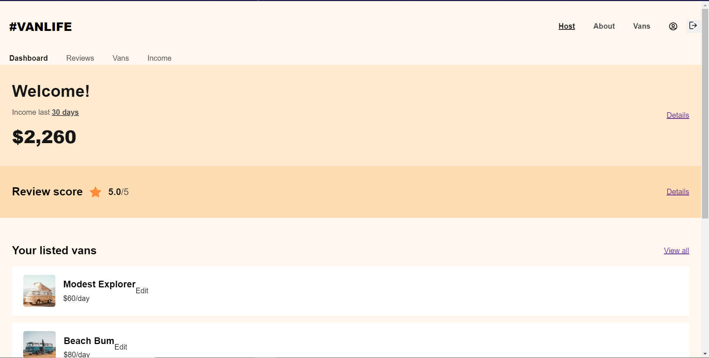
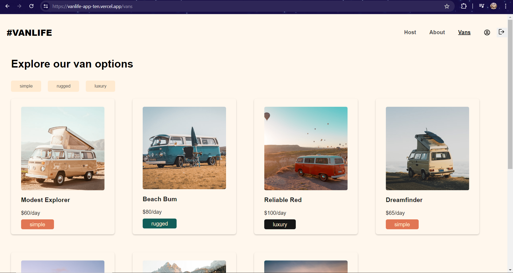
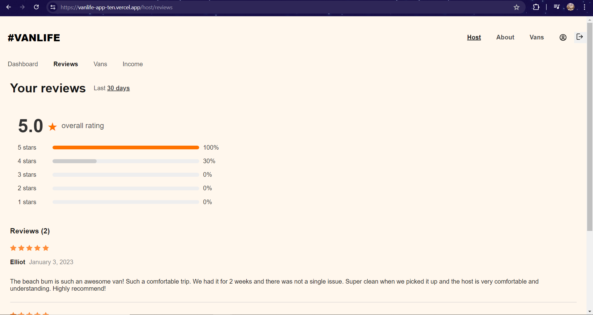
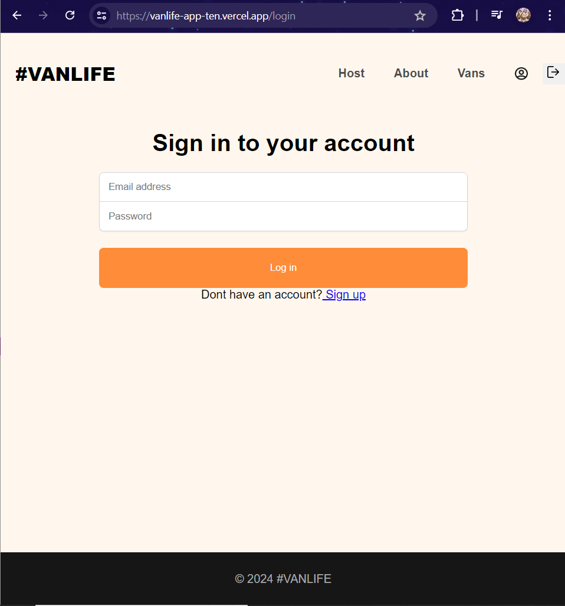

# VanLife 

Van Life App is a React-based application that allows users to explore various vans, view detailed information, check pricing, and read reviews. This project leverages modern web technologies to provide a seamless and engaging user experience.

## Site Link

https://vanlife-app-ten.vercel.app/
## Screenshots

## Features

- Explore Vans: Browse through a selection of vans with detailed descriptions and images.
- Van Details: View in-depth information about each van, including specifications and features.
- Pricing Section: Check out the pricing details for each van.
- Reviews Section: Read reviews from other users to help make an informed decision.

## Built with

- React JS
- React Router
- Mirage JS
- Firebase/Firestore
##  Platforms
- vercel

